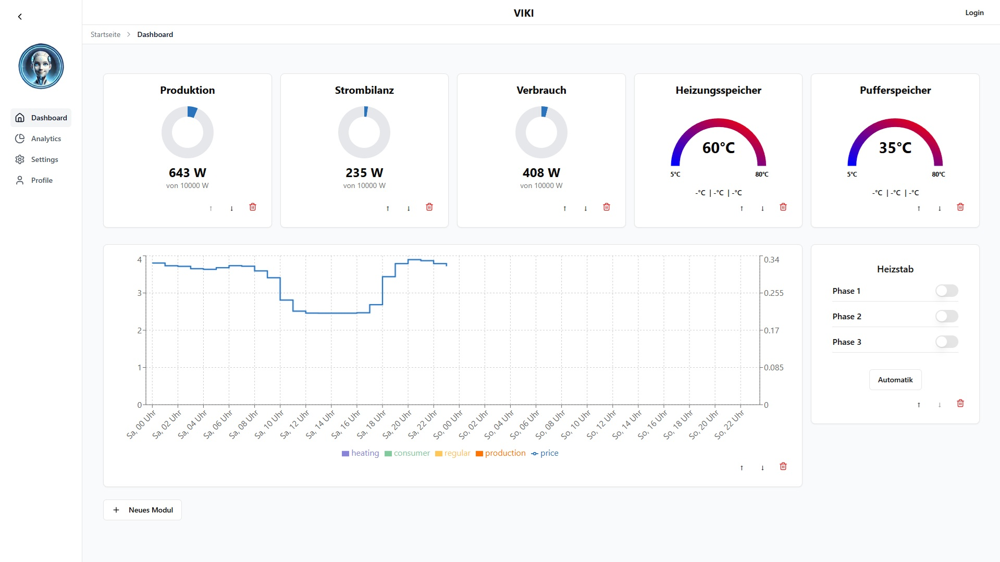
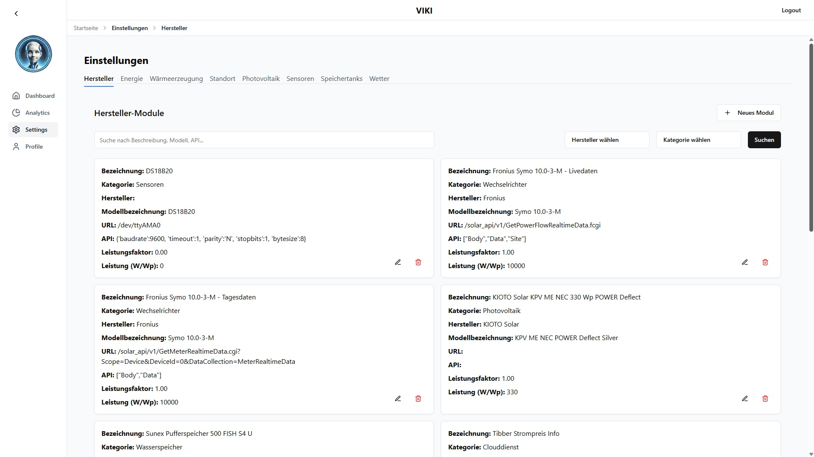
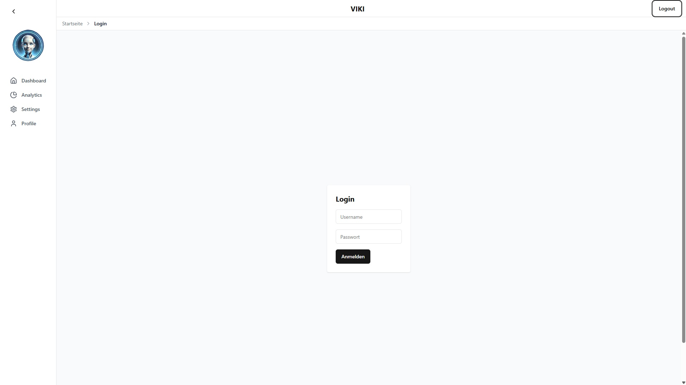
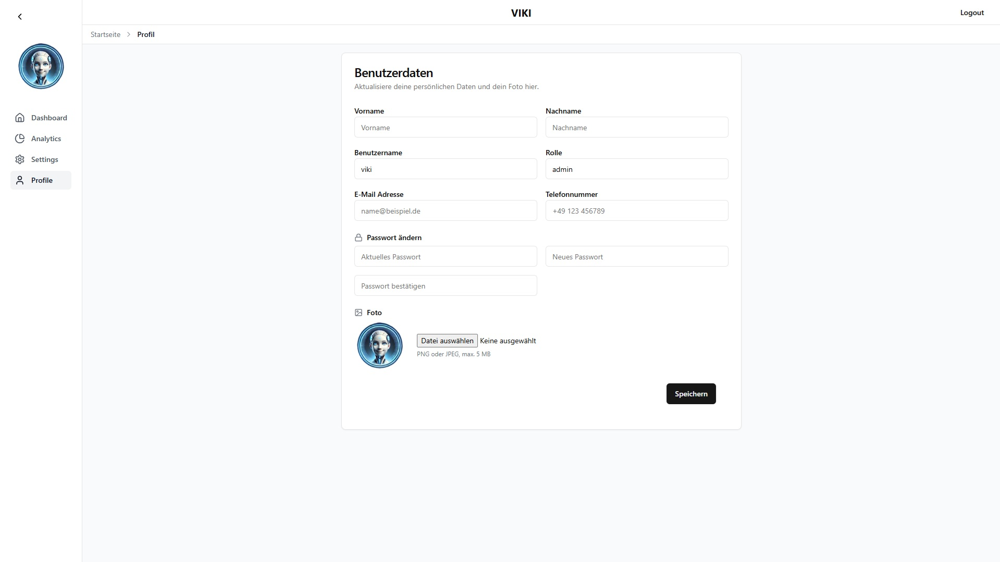

# V.I.K.I - Heat - Frontend

A modern React + TypeScript frontend for visualizing and controlling home energy & heating data.
Built with **Vite**, **Tailwind CSS**, **Radix UI/shadcn**, and **Recharts**.
This part contains the **frontend** only — it consumes data from a separate backend service.

> Status: **Open Source** project with basic functionalities under development and ready for further
> development. Tests are **not yet implemented**.

---

## Table of Contents

- [Features](#features)
- [Tech Stack](#tech-stack)
- [Project Structure](#project-structure)
- [Getting Started (Local Development)](#getting-started-local-development)
- [Docker](#docker)
- [Configuration & Environment](#configuration--environment)
- [Screenshots](#screenshots)
- [Available Scripts](#available-scripts)
- [Contributing](#contributing)
- [License](#license)

---

## Features

- **Authentication UI** (login/register/profile) using cookie-based sessions and CSRF protection.
- **Dashboard** with multiple modules:
  - Energy chart (consumption, production, pricing) using **Recharts**
  - Inverter charts (production, consumption, coverage, battery capacity)
  - Heating tank ring charts (buffer & heating tanks)
  - Phase switch panel for heat pipes & heating mode control
- **Settings** sections for energy, heating, location, manufacturer, photovoltaic, sensors, tanks, and weather.
- **Responsive layout** with a collapsible sidebar and header navigation.
- **UI primitives** built on **Radix UI** and **shadcn/ui** components.
- **TypeScript-first** codebase with modular hooks and utilities.

> All data is fetched from the backend via REST endpoints under `/api/*`.
> Real-time support (Socket.IO) is prepared in the configuration, but not used in the current code.

---

## Tech Stack

- **Framework**: React 18 + TypeScript
- **Build Tool**: Vite
- **Styling**: Tailwind CSS, tailwind-merge, tailwindcss-animate
- **UI Library**: Radix UI + shadcn/ui (prebuilt components in `src/components/ui`)
- **Routing**: React Router
- **Charts**: Recharts
- **Icons**: lucide-react
- **HTTP**: built-in `fetch` with `credentials: "include"` for authenticated calls
- **Container**: Docker (multi-stage build) + Nginx for static serving & API proxy
- **Node/NPM**: Node 18 (Dockerfile uses `node:18-slim`), npm with `package-lock.json`

---

## Project Structure

```
src/
  App.tsx
  index.css
  main.tsx
  components/
    dashboard/
    layout/
    navigation/
    selectors/
    ui/
  hooks/
  routes/
    settings/
  utils/
```

_Notable files:_
- `vite.config.ts` – Vite base config + dev proxy for `/api` and `/socket.io` to `http://viki-backend:5000`
- `nginx.conf` – Production Nginx config: serves SPA and proxies `/api` and `/socket.io` to the backend
- `Dockerfile` – Multi-stage build (Vite build → Nginx image)
- `src/components/ui/*` – shadcn/ui component set
- `src/routes/*` – pages (Dashboard, Analytics, Settings, Auth)

---

## Getting Started (Local Development)

> The frontend expects the backend to be reachable at **`http://viki-backend:5000`** (see `vite.config.ts`).
> If your backend runs at `http://localhost:5000`, either **add a hosts entry** or adjust the proxy target.

### Prerequisites
- Node **18.x** and npm
- A running backend (see separate backend README)

### 1) Install dependencies
```bash
npm ci
```

### 2) Start the dev server
```bash
npm run dev
```
By default Vite serves on `http://localhost:5173`. All requests to `/api/*` and `/socket.io` are proxied to `http://viki-backend:5000`.

### Option A — keep proxy as-is (recommended with Dockerized backend)
If your backend runs as a Docker container on the same Docker network with the **container name** `viki-backend`, the dev proxy will work out of the box once the name resolves from your host.

### Option B — backend on localhost
If your backend listens on `http://localhost:5000`, you have two easy options:

- **Hosts entry** (Linux/macOS):
  ```bash
  echo "127.0.0.1 viki-backend" | sudo tee -a /etc/hosts
  ```
  (Windows: add `127.0.0.1 viki-backend` to `C:\\Windows\\System32\\drivers\\etc\\hosts`)

- **Change proxy target** in `vite.config.ts`:
  ```ts
  proxy: { '/api': { target: 'http://localhost:5000', changeOrigin: true },
           '/socket.io': { target: 'http://localhost:5000', ws: true, changeOrigin: true } }
  ```

---

## Docker

A production-ready image is built with a multi-stage Dockerfile and served via **Nginx**.

### Build the image
```bash
docker build -t viki-heat-frontend:latest .
```

### Run the container
```bash
# If your backend runs as a container named "viki-backend" on a custom network:
docker network create viki-net || true
docker run -d --name viki-backend --network viki-net your-backend-image

# Start the frontend and join the same network:
docker run -d --name viki-heat-frontend --network viki-net -p 8080:80 viki-heat-frontend:latest
# → Frontend at http://localhost:8080
```

### Alternative: backend on the host (localhost)
The Nginx config proxies to `http://viki-backend:5000`. To make that resolve inside the container:
```bash
docker run -d --name viki-heat-frontend -p 8080:80 \
  --add-host viki-backend:host-gateway \
  viki-heat-frontend:latest
```
This maps the hostname `viki-backend` used in `nginx.conf` to your host machine; ensure your backend listens on `localhost:5000`.

---

## Configuration & Environment

This frontend does **not** require `.env` variables by default.

- **API base**: hard-coded to `/api/*` in code; proxied to `http://viki-backend:5000` in **dev** (`vite.config.ts`) and **prod** (`nginx.conf`).
- **Auth**: uses `credentials: "include"` and expects a `csrf_access_token` cookie; requests add `X-CSRF-TOKEN` header where needed.
- **Routing**: SPA fallback is enabled in Nginx (`try_files $uri /index.html;`).

If your backend URL/port differs, adjust `vite.config.ts` (dev) and `nginx.conf` (prod) accordingly.

---

## Screenshots

Below are a few example views. Image files live under `../../documentation/` (relative to this README).

- 
- 
- 
- 

---

## Available Scripts

```bash
# Start dev server (Vite)
npm run dev

# Build production assets into ./dist
npm run build

# Preview the production build locally
npm run preview
```

_Tests_: There are **no tests yet**. Contributions to add unit/integration/E2E tests are welcome.

---

## Contributing

Contributions are welcome! Suggested workflow:

1. Fork the repository & create a feature branch:
   ```bash
   git checkout -b feat/your-topic
   ```
2. Install deps & run the dev server:
   ```bash
   npm ci && npm run dev
   ```
3. Commit with conventional messages and open a Pull Request.

Please keep UI components accessible (Radix/shadcn patterns) and prefer TypeScript.

---

## License

This project is licensed under the **MIT License**. See [LICENSE](../../LICENSE) for details.
